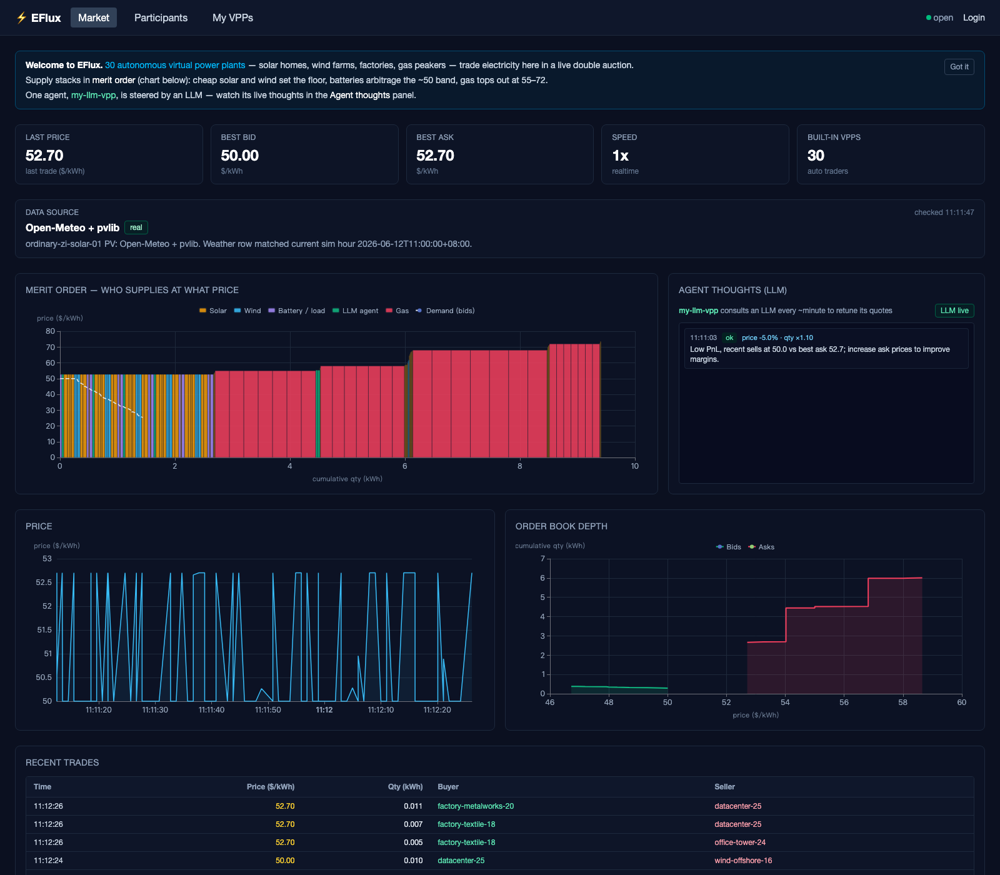
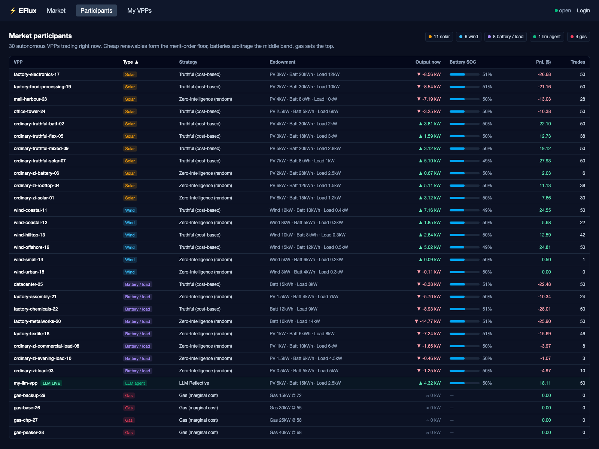
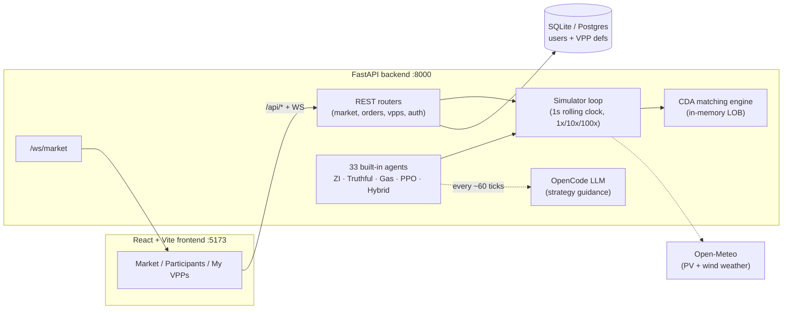

# EFlux — Agent-based VPP Electricity Trading Platform

VPP agents trade in a continuous double auction electricity market. Heterogeneous DER endowments (PV + battery + flexible load), online strategy learning (PPO + LLM hybrid strategy guidance).



## The 30-second tour

1. **Open the Market page** (`/`) — the **merit-order chart** shows every resting
   offer as a price-tall block, cheapest first: solar/wind at the floor,
   batteries in the middle band, gas (55–72) on top, demand as a dashed line.
   Where the curves meet, trades clear — live, every 2 seconds.
2. **Watch the Agent thoughts panel** — four participants (`my-llm-vpp` plus
   three persona rivals: arbitrageur, wind farmer, demand buyer) are
   steered by an LLM strategist that reviews market state every ~minute and
   biases their trading primitives; its reasoning streams here, no login needed.
3. **Open Participants** — all 33 autonomous VPPs with strategy badges, live
   battery SOC, producing/consuming state and PnL. Sort by PnL to see who's
   winning.

   
4. **Join the market** — log in (passwordless, dev token autofills), create a
   VPP, submit a buy at ~80 → instant fill against the cheapest ask in the
   stack. Your trade appears in the tape, counterparty named.
5. **Flip the speed control** to 10x/100x (KPI bar, logged in) and watch sim
   time accelerate. External orders lock out at fast speeds by design.

Full click-by-click pitch script: [docs/DEMO.md](docs/DEMO.md).

## Architecture



## Status

Fully working demo: backend + frontend + all four agent tiers. The default
scenario ([scenarios/default.yaml](scenarios/default.yaml)) runs 33 built-in
VPPs — rooftop-solar households, wind farms (two on real Open-Meteo wind
speed), factories with industrial shift loads, commercial buildings, a
datacenter, and four gas generators that top the merit order — plus the
LLM-managed VPP whose guidance timeline (risk posture, primitive preferences,
and rationale per LLM round-trip) is visible on the *My VPPs* page. Market state (orders, trades,
PnL) lives **in memory** — restarting the backend resets the market; the DB
only persists users and VPP definitions.

Agent order sizing: with a 1-second tick, per-tick net energy is tiny, so each
VPP accumulates its untraded energy balance (`pending_net_kwh`) across ticks
and quotes once the balance clears `min_qty` — roughly one order every 10–30s
per agent.

## Stack

- **Backend**: Python 3.12 + FastAPI + SQLAlchemy 2 (async) + Postgres + Redis Streams
- **Market**: CDA limit order book, rolling clock with adjustable speed (1x/10x/100x)
- **Agents**: ZI baseline → Truthful → PPO (Ray RLlib) → HybridPolicyAgent (LLM strategist over structured primitives)
- **Frontend**: React + Vite + ECharts
- **Package mgmt**: `uv`

## Local Dev (macOS)

### 1. Prereqs

Install [Homebrew](https://brew.sh/) if you don't have it, then:

```bash
brew install python@3.12 node pnpm uv
```

### 2. Bootstrap

```bash
# this project's venv is .env/, not uv's default .venv/
export UV_PROJECT_ENVIRONMENT=.env
uv venv .env --python 3.12
uv sync --extra dev
cp config.env.example config.env   # defaults work for SQLite dev
```

### 3. Run

```bash
./tasks.sh dev                     # FastAPI with --reload on :8000
# or:
.env/bin/python -m uvicorn eflux.api.main:app --reload
```
Swagger UI: http://localhost:8000/docs

### 4. Smoke test (in another shell)
```bash
./tasks.sh smoke    # REST: magic-link → session → VPP create → aggressive order
./tasks.sh ws       # WebSocket: 5 live market events
```

### 5. Frontend (separate shell)
```bash
./tasks.sh fe-install   # one-time: pnpm install
./tasks.sh fe-dev       # Vite dev server on :5173 (proxies /api + /ws to backend)
```
Open http://localhost:5173/ — backend must be running on :8000.

Frontend stack: Vite + React 18 + TypeScript + Tailwind v4 + ECharts.
Pages:
- `Market` (public) — merit-order supply stack, live LLM agent-thoughts feed,
  price chart, order book depth, trade tape, data-source banner, speed control
  (1x/10x/100x, when logged in)
- `Participants` (public) — all 33 built-in VPPs: strategy badges, endowments,
  live output, battery SOC, PnL; sortable
- `My VPPs` (auth) — create VPPs, submit orders, per-VPP performance + the LLM
  guidance timeline

An app-wide banner warns when the backend is unreachable (stale data) and
announces detected backend restarts (the in-memory market starts over).

### 6. One-click launcher
```bash
./tasks.sh start    # = ./scripts/start-all.sh
```
What it does:
- starts backend in the background (PID/log in `.run/backend.{pid,log}`)
- starts frontend in the background (PID/log in `.run/frontend.{pid,log}`)
- waits for both `/health` and `/` to respond
- opens your default browser to http://localhost:5173/

Stop everything: `./tasks.sh stop` (= `./scripts/stop-all.sh`).
Tail logs while running: `tail -f .run/backend.log` / `tail -f .run/frontend.log`.

### 7. Database migrations (alembic)
Schema lives in `alembic/versions/`. The dev path runs `Base.metadata.create_all` at startup so a fresh SQLite file just works, but for any non-dev environment (or whenever you change models) drive everything through alembic:

```bash
./tasks.sh migrate                        # = alembic upgrade head
./tasks.sh makemigration "add foo column" # autogenerate next migration
```

To exercise the migration-only path (production-style), set `EFLUX_AUTO_CREATE_SCHEMA=false` in `config.env` — lifespan will then refuse to create tables and you must run `./tasks.sh migrate` first.

### 8. Default scenario
On startup, 33 built-in VPPs are loaded from `scenarios/default.yaml`
(each entry validated as an [AgentSpec](docs/AGENT_SPEC.md); override with
`EFLUX_SCENARIO_FILE`): 10 residential/rooftop-solar VPPs, 6 wind farms
(coastal ones on real Open-Meteo wind speed), 6 factories with industrial
shift loads, 3 commercial buildings, 4 gas generators (dispatchable supply at
marginal cost 55–72, the market's soft price cap), plus **four LLM-managed
HybridPolicyAgents** (`my-llm-vpp` and three persona rivals). Each hybrid agent
uses a truthful valuation oracle, a fast strategy-primitive policy, a deterministic
order compiler, a risk-gated Truthful fallback, and a slow LLMStrategist that
recommends/discourages primitives plus `risk_budget` and `soc_target`.
Agents: `zi | truthful | gas | strategy | hybrid | zip | gd | aa` per YAML entry
(`reflective` is still accepted as a legacy alias). They trade against
each other continuously — merit order is renewables (~floor) → battery band
(~52.7) → gas, with demand bids rising toward 75 under deficit
(`demand_beta`) and resting orders expiring after `EFLUX_ORDER_TTL_SEC`
(default 180 s). Connect your own VPPs via `POST /vpps` then `POST /orders`
(see [docs/AGENT_SPEC.md](docs/AGENT_SPEC.md) for the full external-agent guide).

Useful market endpoints (all public, no auth):
- `GET /market/snapshot?depth=N` — order book depth + KPIs + data-source status
- `GET /market/trades?limit=N` — recent trade history (used by the UI to backfill charts)
- `GET /market/participants` — VPP id → name/strategy directory (trade-tape labels)
- `GET /market/supply_curve` — every resting order with per-VPP category attribution (the merit-order chart)
- `GET /market/agents` — live roster: strategy, endowment, SOC, PnL, current output per built-in VPP
- `GET /market/reflections?limit=N` — LLM guidance feed across managed agents, newest first
- `GET /leaderboard?scope=session|alltime` — durable rankings (endowment-normalized score v1);
  results persist across restarts (`/leaderboard/sessions`, `/leaderboard/history` for equity curves)
- `GET /benchmarks` — recorded offline backtest runs (manifest, per-agent metrics, charts)
- `POST /market/speed` (auth) — switch the rolling clock between 1x/10x/100x at runtime

The *My VPPs* page surfaces the LLM agent end-to-end: click the `my-llm-vpp`
card for PnL/SOC/trades plus the **guidance timeline** — each LLM round-trip
with risk/primitive guidance, the model's rationale, and failures (the badge shows
live / degraded / offline health). `GET /vpps/managed/{id}/performance` returns
the same data as JSON.

### Important notes
- The venv is at `.env/`, not uv's default `.venv/`; always `export UV_PROJECT_ENVIRONMENT=.env` first (the shell scripts already do this).
- Env vars file is `config.env` (not `.env`) to avoid clashing with the venv dir.
- `key.txt` holds the OpenAI-compatible LLM API key (gitignored). The default
  model template is `deepseek-v4-pro` via the configured base URL. With
  `EFLUX_REFLECTIVE_ENABLED=true` + base URL + model configured, the live LLM
  strategist refreshes every `EFLUX_REFLECTIVE_INTERVAL_TICKS` ticks;
  `EFLUX_LLM_TIMEOUT_SEC` (default 120) bounds each call.
- Speed lock: external (user-submitted) orders only allowed at `market_speed=1.0`. Fast modes are for training/replay.
- Market state is in-memory by design — restart wipes orders/trades/PnL.

### Backtests

`./tasks.sh backtest` runs the backtest-only historical runner. Defaults are one
month, `1s` ticks, the latest per-market roster (`scenarios/p2p.yaml` or
`scenarios/realprice.yaml`), and strict live LLM calls once per simulated hour.
LLM failures abort the backtest; live market fallback behavior is unchanged.
Artifacts are written under `artifacts/backtests/`.

## Run with Docker

No local Python/Node needed — one command brings up the whole demo:

```bash
docker compose up --build     # → http://localhost:8080
```

Two containers: `backend` (FastAPI + simulator, SQLite inside the container)
and `web` (nginx serving the built frontend, proxying `/api/*` and `/ws` to
the backend — same rules as the Vite dev proxy). Optional profiles:

```bash
docker compose --profile redis up      # durable event bus (Redis Streams)
docker compose --profile postgres up   # users/VPPs in Postgres
```

Uncomment the matching `EFLUX_*` environment lines in
[docker-compose.yml](docker-compose.yml) when enabling a profile, and mount
`key.txt` + set the LLM vars there to bring the hybrid LLM strategist fully online
in the container.

## Project Layout

```
conf_1/
  .env/                # Python venv (.env/, not uv's default .venv/)
  config.env           # local env vars (gitignored)
  key.txt              # LLM API key (gitignored)
  pyproject.toml
  tasks.sh             # dev task runner (dev/run/smoke/ws/fe-dev/start/stop/...)
  Dockerfile           # multi-stage: frontend build → backend → nginx web tier
  docker-compose.yml   # one-command demo (+ optional redis/postgres profiles)
  deploy/nginx.conf    # web-tier proxy rules (mirror of the Vite dev proxy)
  docs/
    DEMO.md            # 3-minute click-by-click pitch script
  scenarios/
    default.yaml       # built-in VPP roster (33 VPPs: solar/wind/factory/commercial/gas/LLM)
  scripts/
    start-all.sh       # backend + frontend in background + open browser
    stop-all.sh        # kill backend + frontend
    ws_smoke.py        # WS smoke test (direct backend)
    ws_smoke_proxy.py  # WS smoke test (via Vite proxy)
  src/eflux/
    api/               # FastAPI app, routers, WS handlers
    auth/              # passwordless email + API key
    db/                # SQLAlchemy models, session
    market/            # LOB matching engine, rolling clock, events
    vpp/               # VPP abstraction + DER models
    agents/            # ZI / Truthful / PPO / Hybrid / legacy Reflective
    bridge/            # Redis Stream <-> WebSocket
    simulator/         # in-process runner
    config.py
    cli.py
  alembic/             # migrations
  tests/
```

## Postgres + Redis

Default dev setup uses SQLite (`eflux_dev.db` in repo root) and the in-process **InMemoryBus** (no Redis required). Both are configured via `config.env`.

### Switching to Postgres
```bash
brew install postgresql@16 && brew services start postgresql@16
# Edit config.env: comment out the SQLite EFLUX_DB_URL, uncomment the Postgres one.
./tasks.sh migrate    # alembic creates the schema on the new DB
```

### Real PV physics (Open-Meteo + pvlib)
By default `vpp.PV.output_kw()` is a diurnal-sine stub. Install the `data` extras to drive PV from real weather data via pvlib's `ModelChain`:
```bash
uv sync --extra data    # adds pvlib + pandas
./tasks.sh dev          # default solar VPP auto-uses HKU rooftop (22.28, 114.13)
```
The simulator fetches a [today−2, today+2] window from Open-Meteo's **forecast**
endpoint (the archive lags real-time and can never cover "now"), so the current
sim hour is always inside the data. Backend log prints `Fetching weather … via
https://api.open-meteo.com/v1/forecast` on startup; past days are parquet-cached
under `data/cache/weather/` (today/future days are not — the forecast moves).
The Market page banner shows live data-source status, re-checked every 60s.
Disable explicitly with `EFLUX_PV_PHYSICAL=false`. User-created VPPs (via the UI
or `POST /vpps`) can opt in by passing `pv_lat` + `pv_lon` + (optional)
`pv_tilt`, `pv_azimuth` in the params dict — the *MyVPPs* page has an
"advanced" toggle that exposes these fields.

To set expectations: only VPPs with site coordinates use real weather — in the
default roster that's the first rooftop-solar VPP and the two coastal wind
farms; the other built-ins deliberately run synthetic profiles (diurnal sine
PV, AR(1) gust wind) so the demo works offline. The data-source banner always
tells you which is which.

### Switching to Redis Streams (event bus)
By default events flow through `InMemoryBus` (in-process fan-out). For multi-process / replay / durable streams use Redis:
```bash
brew install redis && brew services start redis
# In config.env (or shell env): EFLUX_BUS_BACKEND=redis
./tasks.sh dev        # backend log should print "Using RedisStreamBus at ..."
```
If Redis is unreachable on startup, lifespan logs a warning and silently falls back to `InMemoryBus` so the app keeps working.

## License

All rights reserved (pre-release; license to be determined at public release).
